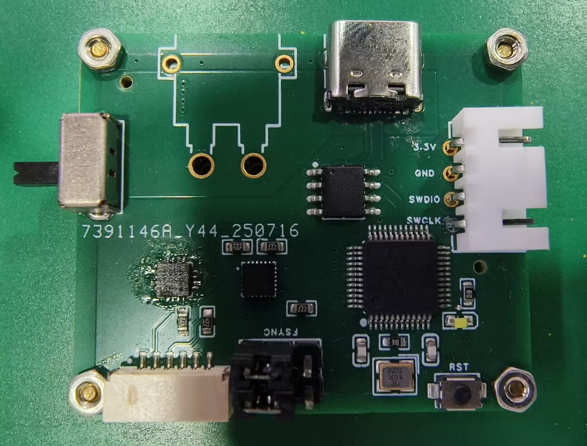

# -log
[25/10/24]目前是集成了陀螺仪(MPU6500),磁力计(QMC5883P)的输出欧拉角或者相关数据的姿态传感器.yaw轴存在一定延迟,pitch和roll都十分准确且灵敏.最高支持500Hz欧拉角输出速率.

---

## 具有开源的硬件

请移步:https://oshwhub.com/jealousy321/attitude-sensor-mpu6500--qmc588

成品图片

演示效果

---

联系方式QQ:2581135738
